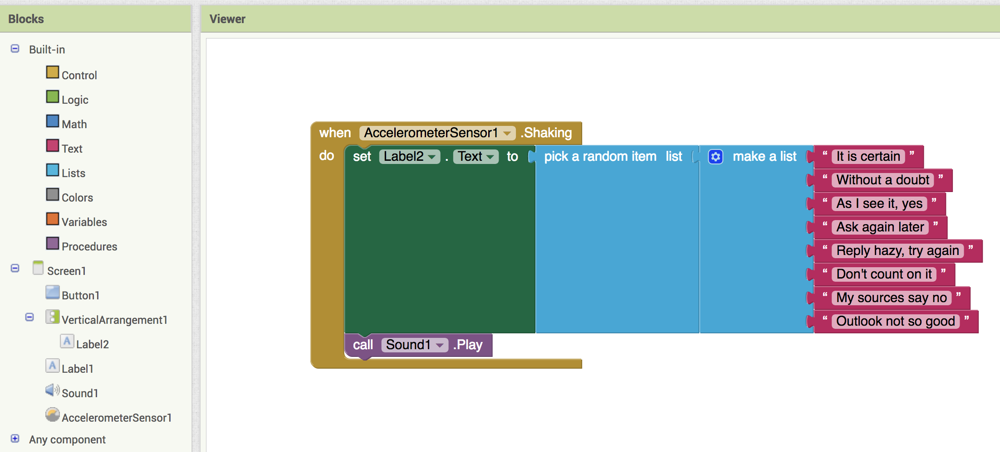

# Building Mobile Apps

## UON Computer Science 4 Schools

### Introduction to Coding and Computational Thinking Workshop

#### Presented by Daniel Hickmott

---

# Session Plan

- Presentation: Overview of Mobile Apps & AppInventor (~15 minutes)
- Hands-On Activities (~1.5 hours)

---

# Presentation Contents

- What is AppInventor?
- How is AppInventor Used in Education?
- What Can You Create with AppInventor?
- Alternatives to AppInventor
- Activities

---

# What is AppInventor?

- A *Blocks language* (like Scratch) that can be used to create Android apps 
- Allows you to interact with phones’ and tablets’:
  - Accelerometer sensor
  - GPS
- All you need is a Google account – you don’t even need a mobile or tablet!

---

---

---

# AppInventor in K - 12

- Introducing students to *Coding* and *Computational Thinking*[^1]
- App competitions[^2]
- Making games to learn different subjects[^3]

[^1]: http://appinventor.mit.edu/explore/stories/girls-code.html

[^2]: http://appinventor.mit.edu/explore/stories/computer-app.html

[^3]: http://appinventor.mit.edu/explore/stories/deerfield.html

---

# AppInventor App Examples

- Taking pictures of, and reporting, graffiti in the local area[^4]
- Guiding visually impaired students around a school, using voice navigation[^5]
- Locating the bus a student is on, so that their parents know they will get home safely[^6]

[^4]: http://appinventor.mit.edu/explore/stories/east-palo-alto-girls-create-app-clean-graffiti-trash.html

[^5]: http://appinventor.mit.edu/explore/stories/resca-middle.html 

[^6]: http://appinventor.mit.edu/explore/stories/k-8-division-international-app-winner.html 

--- 

# Alternatives to AppInventor

- Desktop / iOS / Android / Windows Phone:
  - TouchDevelop
  - Stencyl

- iOS:
  - Codea
  - Hopscotch

---

# Activities

- Four activities:
  1. Connecting the tablet
  2. HelloPurr
  3. Magic 8-Ball
  4. Making Pong 

- Let us know if you have any questions

