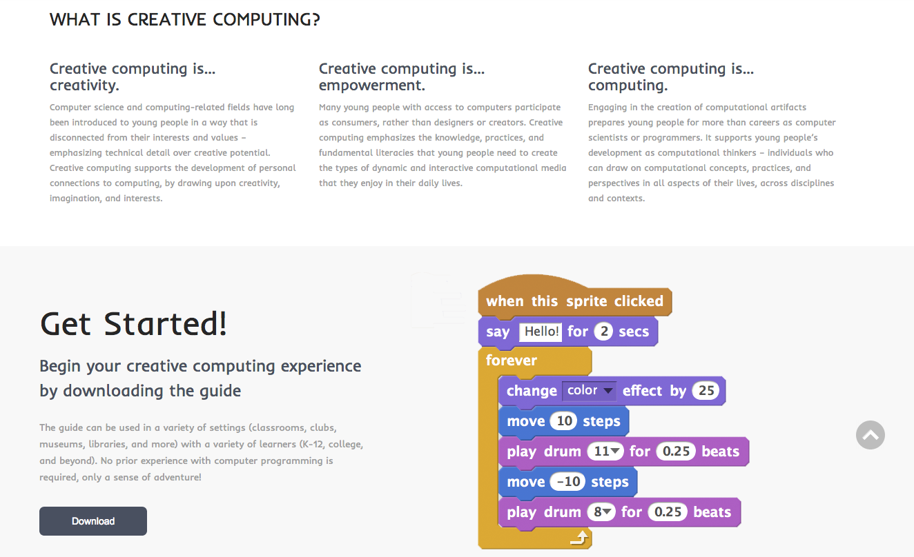
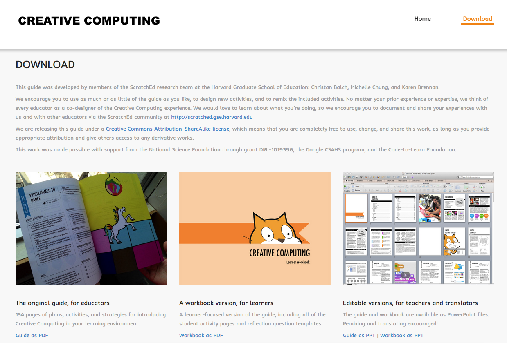
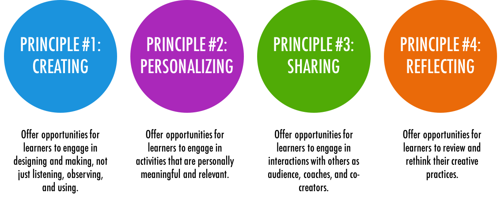

# Creative Computing with Scratch

## UON Computer Science 4 Schools

### Introduction to Coding and Computational Thinking Workshop

#### Presented by Daniel Hickmott

---

# What is Creative Computing?

- Yesterday's *Scratch* activity mostly involved step-by-step exercises
- You may want to allow students to be more self-directed when teaching them to code
- *Creative Computing* encourages students to use code to implement their own ideas and invent

---

# The Creative Computing Curriculum

- Developed by researchers and educators from the *Harvard Graduate School of Education*
- Is focused on using *Scratch* to teach computing, but also involves some *unplugged* activities
- Covers key *computational thinking concepts* and *computational thinking practices*

---

# The Creative Computing Curriculum

- Split into 7 themed units, e.g. *Stories* and *Games*
- The link to the full guide (as a PDF) is on the workshop website, on the *Creative Computing with Scratch* session page
- Editable Powerpoint version is also available for you

---

---

---

# Balancing Structure & Agency

- Research by Dr Karen Brennan (from Harvard) influenced the design of the curriculum materials
- Brennan[^1] investigated the balancing learners' *agency* and *structure* when teaching computing, both inside and outside of schools
- Argued that "we should begin to think about agency and structure not as separate, but as mutually-reinforcing concepts" (p. 194)
- Proposed strategies for teaching computing that became part of the *Creative Computing Curriculum*

[^1]: Brennan, K. Best of both worlds: Issues of structure and agency in computational creation, in and out of school. Dissertation. Massachusetts Institute of Technology, 2013.

--- 

# Four Principles of the Curriculum

 

---

# Today's Session: Units 0 and 1

---

# Teacher Accounts

- We highly recommend getting a *Teacher Account* for managing your classes
- *Creative Computing Curriculum* guide was written before Teacher Accounts were made available
- We will give some examples of how the *Creative Computing Curriculum Guide's* activities can be used with *Teacher Accounts* in this session

---

# Log in as a Student Account

- Please login with the account details I sent you through email
- Create a new *Scratch* program and share it
- Let's look at the Activity tab

---

# Unit 0: Getting Started

- *Unit 0 (Getting Started)* is a preparatory unit focused on getting students to set up *Scratch* accounts and other administrative tasks
- Assumes you are using the online version of *Scratch* and that your school has access to the *Scratch* website

---

# Unit 0: Getting Started

We will look at these activities from *Unit 0* today:

- Design Journals
- Scratch Surprise
- Scratch Studios

---

# Design Journals

- Refer to *Design Journal* activity in *Creative Computing Curriculum* Guide (p. 14)
- [http://bit.ly/designjournal-blog](http://bit.ly/designjournal-blog) has example of a journal in blog form 

---

# Scratch Surprise

- Refer to *Scratch Surprise* activity in *Creative Computing Curriculum* Guide (p. 16)
- Take 10 minutes to explore some *Scratch* blocks and sections that you haven't explored yet
- Try and make the Cat do something surprising!
- Share your project

---

# Scratch Studios

- Refer to *Scratch Studios* activity in *Creative Computing Curriculum* Guide (p. 18)
- I'll create a Scratch Studio for our *Scratch Surprise* programs and send the link to this through email
- Try and add your *Scratch Surprise* project to this new *Scratch Studio*

---

# Unit 1: Exploring

- As mentioned earlier, the design of the *Creative Computing Curriculum* has been influenced by research about balancing learners' *structure* and *agency*
- *Unit 1 (Exploring)* is focused on activities that encourage students to explore the *Scratch* interface and different blocks
- One of the important points of this Unit's overview (p. 24) is that educators don't necessarily have to know every block and part of *Scratch's* interface

--- 

# Unit 1: Exploring

We will look at these activities from Unit 1:

- 10 Blocks
- My Studio

---

# 10 Blocks

- Refer to *10 Blocks* activity in the *Creative Computing Curriculum* Guide (p. 30)
- Take 10 minutes to complete this activity 
- You have to use each of the blocks shown on p. 30 at least once but you can also use them multiple times
- Add to the *10 Blocks* studio if you would like to share your program

---

# My Studio (Remixing)

- In this activity, we will remix an existing Scratch program instead of the activity in the *Creative Computing Curriculum* Guide
- Take 10 minutes to find a program that you'd like to remix and make some change to it
- We'll also briefly look at remix trees and discuss potential issues with students remixing projects

