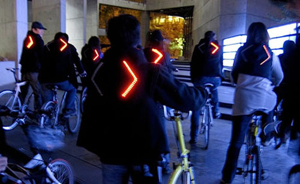

# Physical Computing
# with MaKey MaKeys and Scratch

## UON Computer Science 4 Schools

### Introduction to Coding and Computational Thinking Workshop

#### Presented by Daniel Hickmott

---

# Session Plan

- Presentation: Overview of Physical Computing (~15 minutes)
- Hands-On Activities (~1 hour)

---

# Presentation Contents

- What is Physical Computing?
- Physical Computing & the DT curriculum
- Examples of Physical Computing devices
- MaKey MaKeys
- Physical Computing Activities

---

# What is Physical Computing?

- Usually refers to hardware or software that involves:
	- Physical interaction (not with a keyboard & mouse)
	- The use of sensors to collect data

- Interacting with a motion sensor (e.g. the *Microsoft Kinect*)
- Sensors can be used to record information, e.g. temperature, humidity and noise levels

---

# Physical Computing in ACARA DT

- Years 3 & 4: "_Identify and explore a range of digital systems with **peripheral devices** for different purposes, and transmit different types of data (ACTDIK007)_" 
- Years 5 & 6: "_Design a **user interface** for a digital system (ACTDIP018)_" **&** "_Examine the main components of common digital systems and how they may **connect together** to form networks to transmit data (ACTDIK014)_"

---

# Physical Computing in ACARA DT

- Years 7 & 8: "_Design the **user experience** of a digital system, generating, evaluating and communicating **alternative designs** (ACTDIP028)_"
- Years 9 & 10: "_Develop techniques for **acquiring, storing and validating quantitative and qualitative data from a range of sources**, considering privacy and security requirements (ACTDIP036)_"

---

---

# Examples: Raspberry Pi

---

# Examples: Raspberry Pi

- A computer the size of a credit card
- Originated from the UK
- Can interact with sensors and cameras
- Has a big community - the *Raspberry Pi Foundation*
	- [www.raspberrypi.org](www.raspberrypi.org)

---

# Examples: Wearables

---

# Examples: Wearables

- Devices, like the *Lilypad Arduino*, can be sewed onto fabric
- Can be used for electronic textiles
- e.g. Clothing that have LED lights that change colours to music
- Growing area in research and industry

---

# MaKey MaKey

---

# MaKey MaKey

- *"An Invention Kit for Everyone"*
- Use everyday, conductive, objects to interact with your computer
- e.g. Make a Piano out of bananas or a game controller from Play Doh
- Can interact with all applications, but today we'll use it with *Scratch*

---

# Physical Computing Activities

- Go to the Scratch website: [www.scratch.mit.edu](www.scratch.mit.edu)
- We have two tutorials for you to complete:
  - *Making a Piano*
  - *Making an Interactive Quiz*
- Let us know if you have any questions about MaKey MaKeys or the other devices we mentioned
